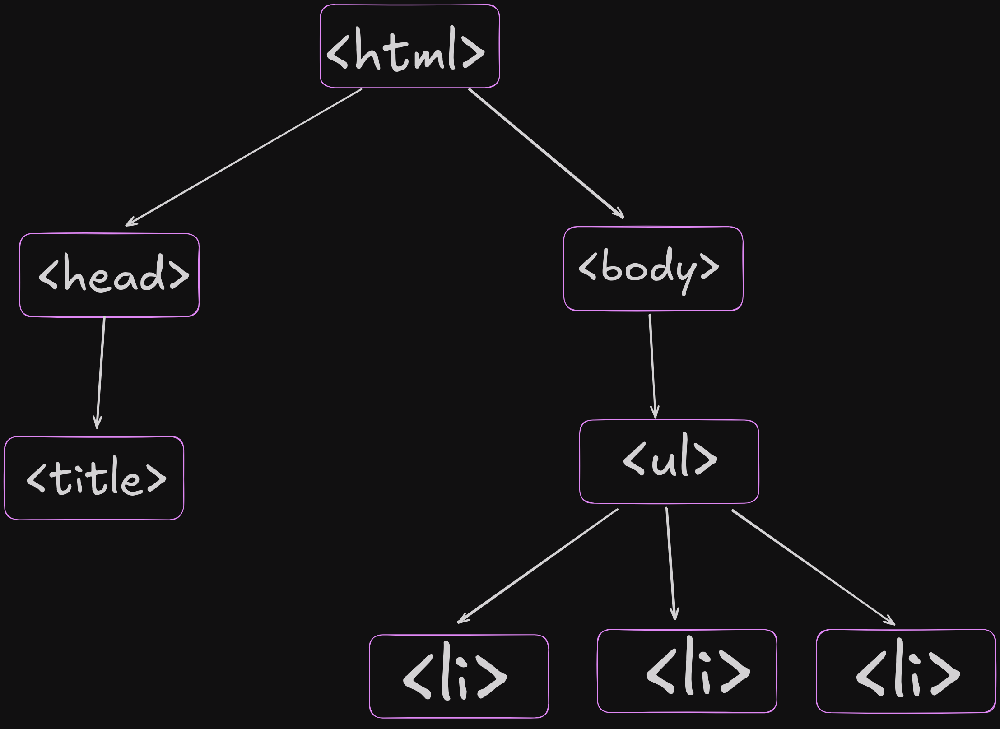
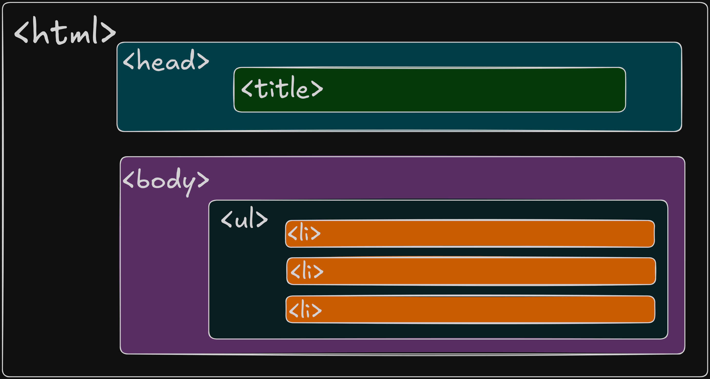

<!-- Author: Daniel Benjamin Perez Morales -->
<!-- GitHub: https://github.com/DanielPerezMoralesDev13 -->
<!-- Email: danielperezdev@proton.me -->

# ***Indice***

- [***Indice***](#indice)
  - [***Explicación de etiquetas padre e hija***](#explicación-de-etiquetas-padre-e-hija)
    - [***Representación en forma de árbol***](#representación-en-forma-de-árbol)
    - [***Representación en forma de cuadro***](#representación-en-forma-de-cuadro)

---

## ***Explicación de etiquetas padre e hija***

- *En HTML, una **etiqueta padre** es aquella que contiene otras etiquetas dentro de sí, mientras que las **etiquetas hijas** son las que están contenidas dentro de la etiqueta padre.*

*En el ejemplo proporcionado:*

```html
<html lang="en">
    <head>
        <title>Listas</title>
    </head>
    <body>
        <ol>
            <li>Elemento 1</li>
            <li>Elemento 2</li>
            <li>Elemento 3</li>
        </ol>

        <ul>
            <li>Elemento 1</li>
            <li>Elemento 2</li>
            <li>Elemento 3</li>
        </ul>
    </body>
</html>
```

- *`<html>` es la **etiqueta padre** de todo el documento. Contiene como hijas a las etiquetas `<head>` y `<body>`.*
- *`<head>` es una **etiqueta hija** de `<html>` y una **etiqueta padre** para `<title>`.*
- *`<body>` es una **etiqueta hija** de `<html>` y una **etiqueta padre** para las etiquetas `<ol>`, `<ul>`, y sus respectivos elementos.*
- *`<ol>` es la **etiqueta padre** que contiene a las etiquetas `<li>` como sus **etiquetas hijas**.*
- *De manera similar, `<ul>` es la **etiqueta padre** de sus etiquetas `<li>` hijas.*

### ***Representación en forma de árbol***

- **En una representación en **forma de árbol**, cada nodo representa una etiqueta, donde las etiquetas hijas se colocan debajo de sus etiquetas padres. Aquí te muestro cómo se vería este documento HTML en forma de árbol:**

```bash
<html>
│
├── <head>
│   └── <title>Listas</title>
│
└── <body>
    ├── <ol>
    │   ├── <li>Elemento 1</li>
    │   ├── <li>Elemento 2</li>
    │   └── <li>Elemento 3</li>
    │
    └── <ul>
        ├── <li>Elemento 1</li>
        ├── <li>Elemento 2</li>
        └── <li>Elemento 3</li>
```

- *En esta estructura, cada nivel del árbol corresponde a un nivel de anidamiento en el HTML. Las etiquetas **padres** se colocan en un nivel superior y las **hijas** en los niveles inferiores.*

---

### ***Representación en forma de cuadro***

- **En una representación en **forma de cuadro** o tabla, podemos visualizar qué etiquetas son padres e hijas a través de su jerarquía:**

| **Etiqueta Padre** | **Etiquetas Hijas**                                 |
|--------------------|-----------------------------------------------------|
| *`<html>`*         | *`<head>`, `<body>`*                                |
| *`<head>`*         | *`<title>`*                                         |
| *`<body>`*         | *`<ol>`, `<ul>`*                                    |
| *`<ol>`*           | *`<li>`, `<li>`, `<li>`*                            |
| *`<ul>`*           | *`<li>`, `<li>`, `<li>`*                            |
| *`<li>`*           | *(Texto: "Elemento 1", "Elemento 2", "Elemento 3")* |

- *En la tabla, se pueden observar claramente las relaciones de **padre e hija**, donde las etiquetas hijas están contenidas dentro de las etiquetas padres.*



